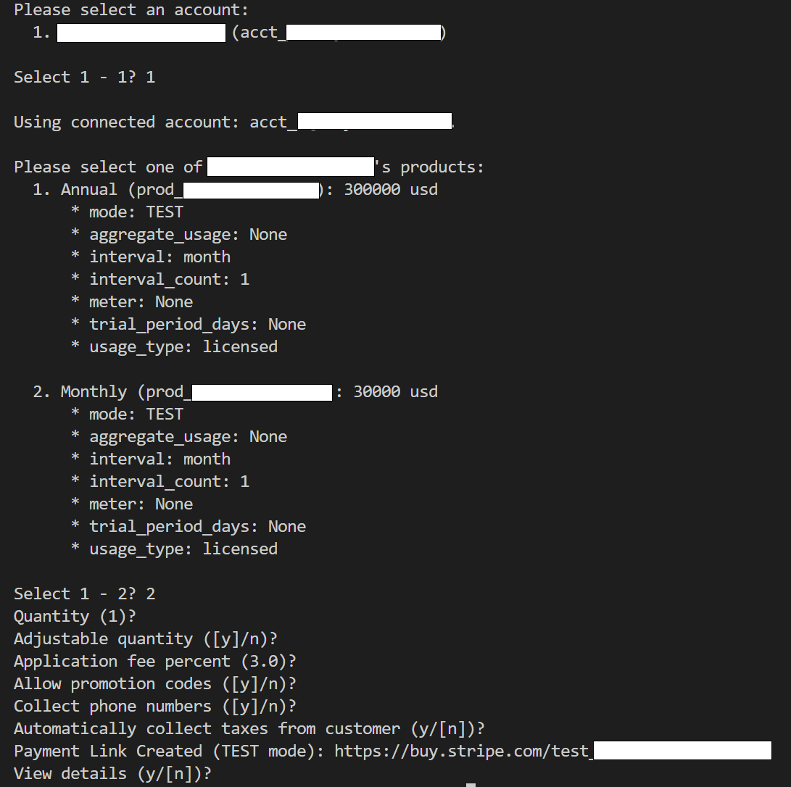

# Stripey

This is a collection of utility methods and classes that are helpful in working with [Stripe](https://stripe.com/).

# Setup

Setting up for development is simple using the `setup.sh` script. It will create a virtual environment and tell you how to activate it.

# Build

To perform a build, just run the `build.sh` script. To change any build settings, modify `pyproject.toml`.

By default, `build.sh` builds code in `dev` mode, which means any version tags have `dev` in the name. You may also pass `-r` or `--release` to `build.sh`, and it will create a build without the `dev` tag, indicating it is ready for release.

# Publish

You can use the `publish.sh` script to push any of your builds to the pypi repo.

# Install

Install the package as either a live-edit installation or a normal installation. If you would like to try one mode and then another, please uninstall first.

## Live-Edit Installation

If you are a developer, you will want to install this package in live-edit mode. This is like installing the package in the normal way, except any changes performed in the package are reflected immediately by any code that does `import my_pkg`. Simply run:

```sh
pip install -e .
```

## Normal Installation

NOTE: THIS IS NOT YET IN PYPI.

<!-- ```sh
pip install happy-common-utils
``` -->

# Usage

Before you can being using `Stripey`, you need a properly configured environment. `Stripey` understands env files, and if you want to use one, you can call it anything you want. `Stripey` looks for `.env` in your current working directory, but you can override it with the `-e` or `--env` parameter.

If you do not want to use env files, no problem. You will, however, need to modify your system environment to contain the following variables:

| Key                              | Value             | Default | Required |
| -------------------------------- | ----------------- | ------- | -------- |
| `STRIPE_KEY`                     | `<api key>`       |         | *        |
| `STRIPE_ADJUSTABLE_QUANTITY`     | `true` or `false` | `false` |          |
| `STRIPE_ALLOW_PROMOTION_CODES`   | `true` or `false` | `false` |          |
| `STRIPE_APPLICATION_FEE_PERCENT` | `0.00 - 100.00`   | `0`     |          |
| `STRIPE_AUTOMATIC_TAX`           | `true` or `false` | `false` |          |
| `STRIPE_COLLECT_PHONE_NUMBERS`   | `true` or `false` | `false` |          |
| `STRIPE_QUANTITY`                | `>= 1`            | `1`     |          |

At this time, `Stripey` only supports one use-case: payment link creation.

## Payment Link Creation

The basic usage of `Stripey` for [PaymentLink creation](https://docs.stripe.com/api/payment-link/create) is as follows:

